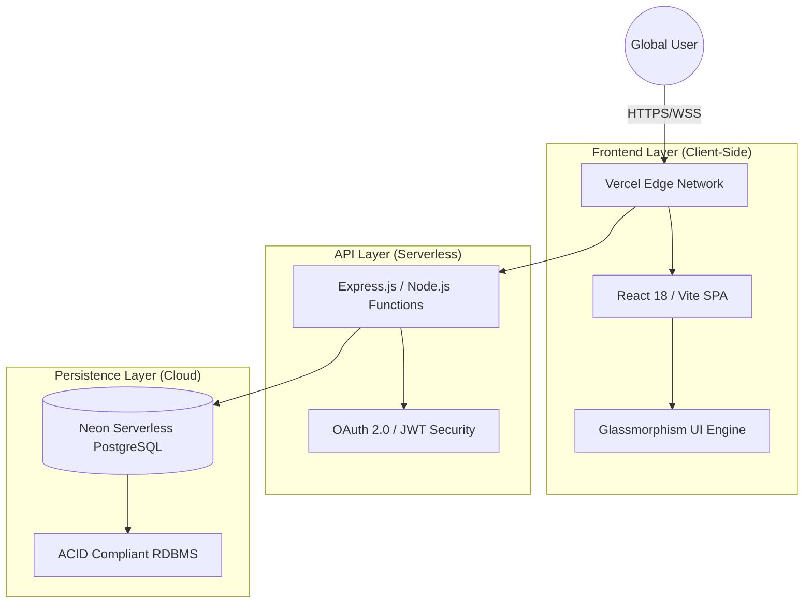

# 🌌 NeonCharts: Advanced Financial Analytics & Trading Ecosystem

[](https://updatedsite-theta.vercel.app)
[](https://neon.tech)
[](LICENSE)

**NeonCharts** is a high-fidelity, industrial-grade financial analytics platform designed for real-time market data visualization and automated economic event tracking. Engineered with a glassmorphism-inspired UI and a resilient serverless backend, it provides a seamless TradingView-style experience for professional traders and analysts.

---

## 🏛️ System Architecture

The platform utilizes a **Modern Distributed Serverless Architecture**, ensuring sub-second global latency and near-infinite horizontal scalability.



---

## 🚀 Core Technologies & Implementation

### ⚛️ Frontend Engineering
- **Vite + React 18**: Leveraged for high-speed module replacement (HMR) and optimized rendering cycles.
- **Tailwind CSS & Modular CSS**: Implementation of a custom design system focused on high-contrast readability and premium aesthetics.
- **Lucide Iconography**: Integrated for a cohesive, professional symbology throughout the interface.

### 🛡️ Backend & Security Infrastructure
- **Serverless Node.js (Express)**: Decoupled API logic processed through Vercel's Edge/Serverless functions.
- **OAuth 2.0 & JWT**: Multi-layered authentication protocol utilizing Google Identity Services and encrypted JSON Web Tokens stored in **HttpOnly / SameSite** secure cookies.
- **Premium Gating**: Middleware-based access control (RBAC) protecting advanced analytics modules (`SymbolDetailView`).

### 🗄️ Database & Data Integrity
- **Neon Postgres**: A serverless PostgreSQL instance with autoscaling capabilities and point-in-time recovery.
- **ACID Transactions**: Guaranteed data consistency for user preferences and premium subscription states.

---

## ✨ Premium Features
- **Real-Time Calendar**: Comprehensive tracking of Global Economic events, Earnings reports, and Dividends.
- **Dynamic Charting**: High-fidelity market visualization with technical analysis tools.
- **Advanced Filtering**: Volatility-based event sorting and global market category segmentation.
- **AI Integration**: Experimental support for Gemini-powered market sentiment analysis.

---

## 👨‍💻 Development Team & Contributors

This project was developed by a specialized team of software engineers focusing on high-performance web ecosystems:

| Contributor | Role |
| :--- | :--- |
| **Omar Jebbari** | Lead Architect & Full-Stack Implementation |
| **Oussama Touate** | Backend Systems & Database Optimization |
| **Zakaria Ammar** | Frontend Infrastructure & UI/UX Design |
| **Salma bel haj** | Security Protocols & Quality Assurance |

---

## 🛠️ Local Development & Deployment

### Environment Configuration
Ensure the following variables are defined in your `.env.local`:
```bash
# Database
DATABASE_URL=your_neon_postgres_url

# Authentication
JWT_SECRET=your_security_token
VITE_GOOGLE_CLIENT_ID=your_google_id
GOOGLE_CLIENT_ID=your_google_id
GOOGLE_CLIENT_SECRET=your_google_secret
```

### Installation
```bash
git clone https://github.com/OmarJebbari/NeonCharts-Traiding-Platform.git
cd NeonCharts-Traiding-Platform/updated_site
npm install
npm run dev
```

---

## 📜 License
Distributed under the **MIT License**. See `LICENSE` for more information.

---
<p align="center">
  <i>Developed with precision for the modern trading era.</i>
</p>
